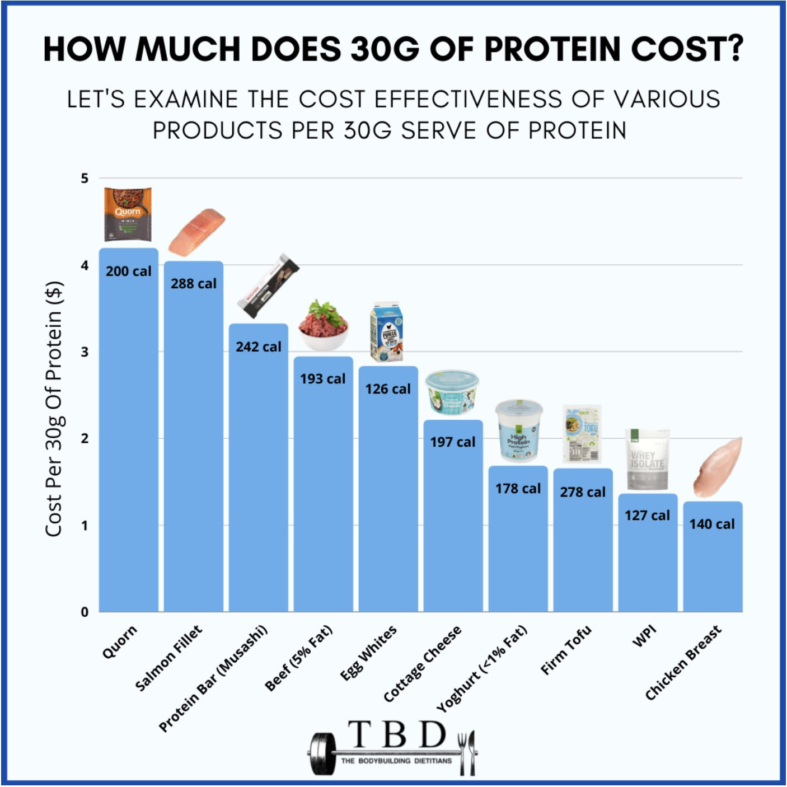
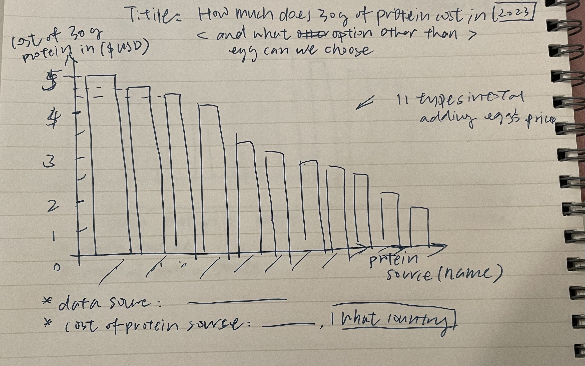
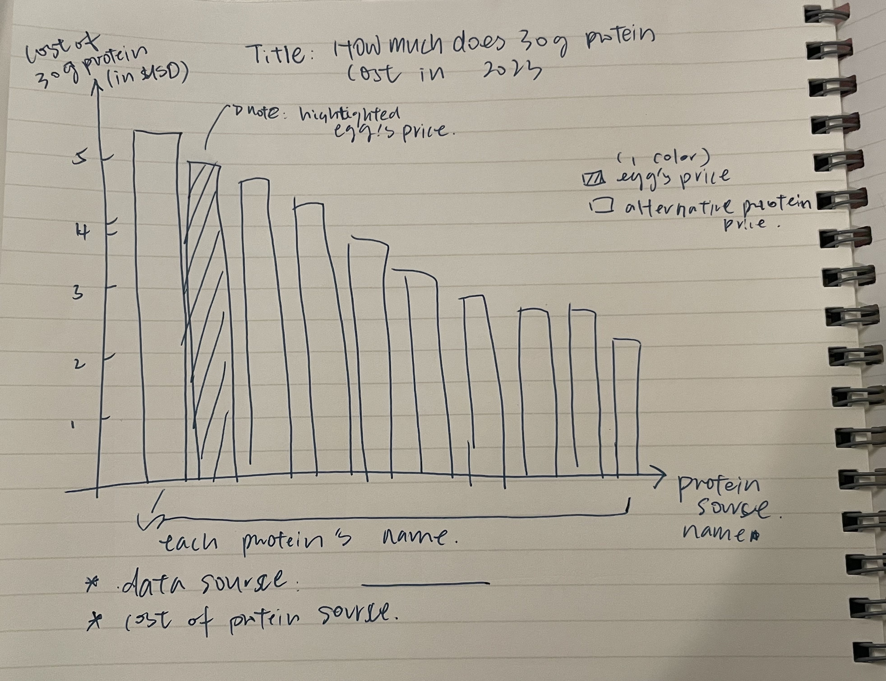

| [home page](https://ranniepeng.github.io/Ran_portfolio/) | [visualizing debt](visualizing-government-debt) | [critique by design](critique-by-design) | [final project I](final-project-part-one) | [final project II](final-project-part-two) | [final project III](final-project-part-three) |

# Critique by Design with Tableau (MakeoverMonday)
### Part 1: Selected visualization and links
Title: [The Cheapest Ways to Get Your Protein Right Now](https://lifehacker.com/the-cheapest-ways-to-get-your-protein-right-now-1850001760)

[Chart Link](https://www.thebodybuildingdietitians.com/blog/how-cost-effective-is-your-high-protein-diet)

> How Much Does 30g Protein Cost?

### Part 2: Critique and Evaluation Summary
In general, I like the type of chart the visualization used for illustration, the bar chart is really easy for the audience to understand the approximate price patterns of the selected 10 protein sources. Also, the x and y-axis labels and the visualization title can help viewers grasp the main takeaway from this visualization. I think it is very helpful to sort the protein source from the most expansive one to the least expansive which enables viewers to see and understand the trend easily. 
I love the idea of using the photo icons of each protein source with the consideration to attract the viewer's attention and make the visualization more interactive and explicit to the audience. However, I am also concerned that those picture icons can be "too much" in terms of the purpose of this visualization and somehow distracting. It is also questionable if each icon truly represents the data (in terms of what brands of yogurt and milk they were using to collect the price data for these items). I would probably delete all those icons in my design just to make the chart clearer with less confusing and distracting information. Also, the calorie notes under the picture icons confused me a bit. When I glanced at the chart, I assumed that those numbers were the price rather than calorie info, so  it took me a longer time to compare the scale and figure out why 200 calories is higher than 288 calories. I would also delete the calorie information from this visualization to keep it simple and less confusing.

### Part 3: Sketch out a Solution
> First Sketch:

### Part 4: Test out and Interviews
**Interview Questions:**
1. Can you what this visualization is about?
2. Is there anything you find surprising or confusing?
3. Is there anything you would change or do differently?
4. Do you think the title is too long?
5. Tracking the time they read the visualization

**Interviewees'profile:**
1. Student, early 20's
   Feedback Summary:
- The sketch is easy to understand and interesting to look at
- Title seems too long to be understand
- Able to grasp key takeaways and compare the prices.
  
3. Adult, mid 50's
  Feedback Summary:
- Fairly easy to understand
- Suggested using different colors to illustrate the difference between Egg and other protein source
- Wanted to know the actual price difference.

> Sketch After Interview:

### Part 5 New solution Build: 
Based on my reactions and evaluations of the original chart and the feedback from interviewees. I would like to redesign a new chart to emphasize the key information and remove the irrelevant and distractive items from the chart to help viewers better understand the concept. [Andy Kriebel's tutorial](https://www.youtube.com/watch?v=45pgu_SrZsg&ab_channel=AndyKriebel) provides a more efficient solution to represent the data in a more interactive dashboard way, so I decided to follow the tutorial and build one dashboard like that. 

<noscript></noscript><object class='tableauViz'  style='display:none;'><param name='host_url' value='https%3A%2F%2Fpublic.tableau.com%2F' /> <param name='embed_code_version' value='3' /> <param name='site_root' value='' /><param name='name' value='HW34_17001073853010&#47;Dashboard1' /><param name='tabs' value='no' /><param name='toolbar' value='yes' /><param name='static_image' value='https:&#47;&#47;public.tableau.com&#47;static&#47;images&#47;HW&#47;HW34_17001073853010&#47;Dashboard1&#47;1.png' /> <param name='animate_transition' value='yes' /><param name='display_static_image' value='yes' /><param name='display_spinner' value='yes' /><param name='display_overlay' value='yes' /><param name='display_count' value='yes' /><param name='language' value='en-US' /><param name='filter' value='publish=yes' /></object>
                

**Developing Process**
First, a bar chart with protein sources as the row and sum of the cost per 20 g protein as the column has been built in which column and row titles are hidden and an average value line has been added to the chart. Then, a sorter based on the price range is set up in order to be used in the later dashboard as a way to change the descending and ascending sorting of the items. Then the parameters: vegan and vegetarian are produced in separate tabs using filtering functions. Next, a blank 900*600 dashboard is created with a vertical container and a title text box. The title is entered into the box and formatting (including font size, color, and inner and outer padding are adjusted). A horizontal container has been added to the dashboard and the bar chart has been dragged in. All controllers and filters are also dragged into the lefthand side of the dashboard and formatted. Lastly, the general format of the chart and the two colors (blue and grey) are added to the dashboard and the data source information has been added in the bottom left. 

**New solution summary and alterations:**
The visualization designed by Andy Kriebel contains a clear structure that includes a single-line title, data labels, and each protein source name. It also grouped and created filters based on dietary choices by including vegan and vegetarian categories to make this visualization more useful for people with more exclusive dietary requirements. Similarly, with the dashboard setting, viewers sort the prices ascending and descending easier which helps them better understand the overall trend. It is interesting to see, with the descending and ascending sorting that canned chicken is the most expensive protein (per 20g).
Note that in this dataset, the egg's price is also included. If I want to emphasize the price comparison between eggs and non-egg proteins, I will use another color besides blue and grey to highlight it. 
Building this dashboard from the tutorial helps me to better understand the overall interface of Tableau in terms of how to format visualization and included texts. I also understand and get used to the logic of building each filter and parameter separately before collaging them into the final dashboard. 
