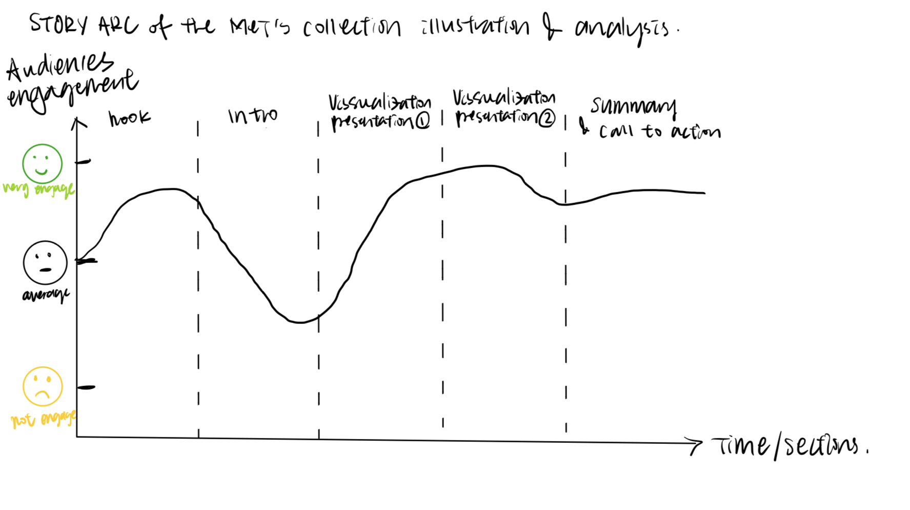
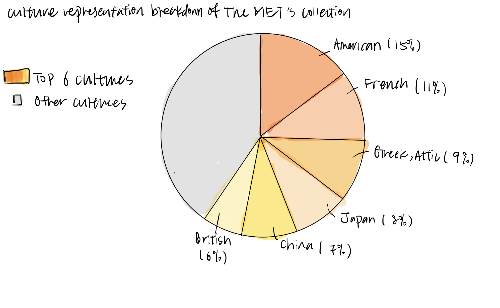
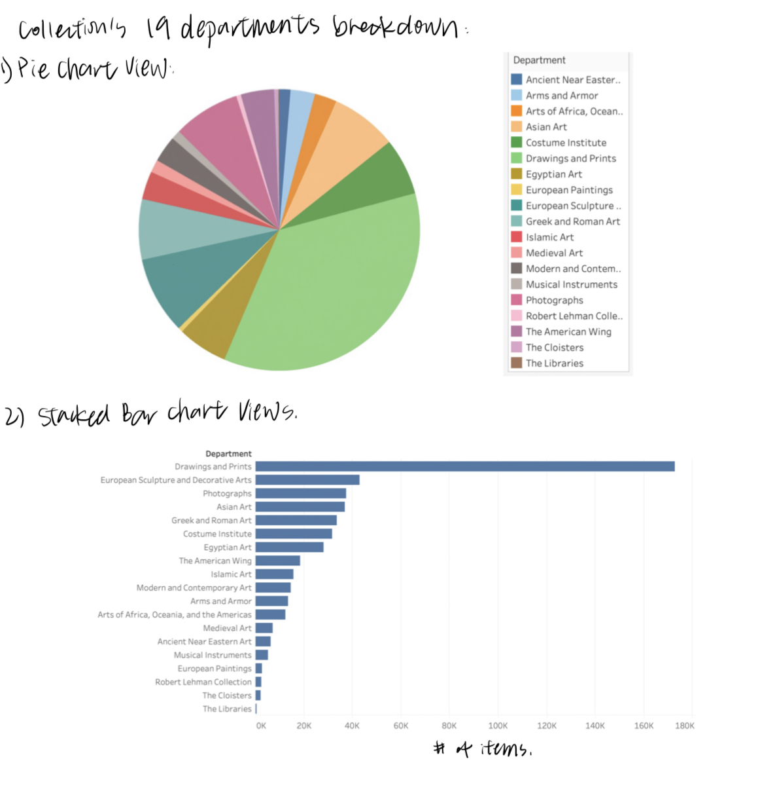
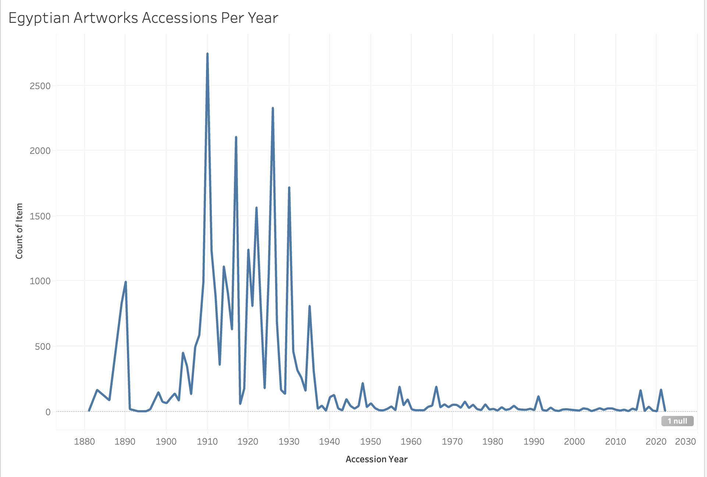

| [home page](https://cmustudent.github.io/tswd-portfolio-templates/) | [visualizing debt](visualizing-government-debt) | [critique by design](critique-by-design) | [final project I](final-project-part-one) | [final project II](final-project-part-two) | [final project III](final-project-part-three) |

# Outline
## Project Incentive and Topic Discussion
The inspiration for my final project comes from my curiosity about every visit to the Metropolitan Museum of Art (The MET). As a student who studies arts, I've visited several times to The MET to go to the exhibition and enjoy its permanent collection. Although for each visit I spent 3 to 5 hours browsing through the galleries, I still haven't gotten the chance to visit all the galleries and take a look at all of the artworks on show. Therefore, I am really curious about how many artworks are in the MET's collection and whether there are artworks from one medium or one culture collected more than the others. Besides the initial curiosity, the Museum's collections and their relevance to its mission statement are also crucial for the overall developments and engagements of its served public. 

The rationale for the close connection between the museum's collections and its mission statement can be mainly divided into 4 aspects: Audience Engagement, Educational Value, Relevance to Society, and Long-Term Sustainability. Therefore it is necessary to evaluate the museum's collection and use the MET, (one of the most popular museums in NYC and the United States) as a case study to analyze its mission alignment and collection management. Similarly, many of the discussions of collection evaluation and management are implemented with more qualitative analysis rather than quantitative analysis which can have more barriers for the public to understand and summarize. Therefore, I would like to take a more quantitative approach to analyze the MET's collection with its mission statement, which will help me to better understand and scope of MET's collection in the covered cultures and its potential (and maybe not voluntary) emphasization on its collection. 

## Main questions to be discussed and What to achieve in this visualization project
According to The [MET's mission statement](https://www.metmuseum.org/about-the-met), which states on its website and I quote here: "The Metropolitan Museum of Art collects, studies, conserves, and presents significant works of art across time and cultures to connect all people to creativity, knowledge, ideas, and one another." In addition, under its stated [collection areas](https://www.metmuseum.org/about-the-met/collection-areas), there are 19 categories. I would like to investigate how many collections are in each of the categories as well as to create a breakdown of its collection based on the artwork's medium and accession years. From the category and medium breakdown, I would like to create visuals to illustrate its distribution. I would also like to investigate if there are any potential trends or relationships in accessing some particular artwork categories over time. 

In terms of the general achievement and overall goal of this project, I am aiming for a better understanding on the MET's collection's accession and the cultures that are connected with the artworks in its collection. This project and the visualization analyses can be used as an illustration and showcase of a large museum institution's collection considerations and help the audience to better understand the (potential) collections accession trend of the MET more explicitly and quantitatively.

### Story Arc of the project and visualizations:
 

The above is a general story arc that illustrates my expectation of the overall delivery of the project's visualization to the audience. First, I would like to start with an interesting hook (such as to resonate with the audience about how a museum's collection can be huge and my experience with the MET can I always cannot go through all the sections I would like to see). Then, I would start to transit and explain my incentive for this project and give the background information of the MET and its mission statement to the audience, which can be interesting to some of the audience but not all of them, thus I anticipant the overall engagement will decrease a bit. After explaining the main topics and questions, I will provide the first part of the visuals related to the general categories and medium breakdowns of the collections and move to the comparison between its collection distribution with its annual audience profile ratio breakdowns as the second part of the visualizations. After all, I will do a summary and have a call to action to the audience (and hopefully) in an engaging way to attract their attention.

### One Sentence Summary:
**"Do Museums really have what we want to see?"**

## Initial sketches
> 1. Culture Representation Pie Chart breakdowns of the MET's Collection overtime

This sketch is here to represent the general culture breakdown of the MET's current collection, which will be used to compare with its annual visitors' demographics info and to understand if there is a balance between its most represented culture and the actual international and domestic visitors.
According to the report of [The MET's annual visitor](https://www.metmuseum.org/press/news/2019/fy-2019-attendance#:~:text=In%20the%20fiscal%20year%20that%20ended%20on%20June%2030%2C%202019,from%20New%20York's%20tristate%20area.) stats on its website, during "the fiscal year that ended on June 30, 2019, international tourists accounted for 28% of the Museum's visitors. Local visitors from the five boroughs of New York City made up 35% of the overall total, and 16% were from New York's tristate area". The MET genuinely holds culture-diverse collections to provide to both international and domestic audiences.

> 3. The MET 19 Departments Collection Volume Breakdown

As illustrated in the above sections, I would like to know which department holds more collections in general, and here are two visuals to deliver that information. Such a breakdown will also be helpful for me and the audience to understand the formation of The MET's collection in a more concrete way. 

> 5. Numbers of Accession Items per Year (1880 to 2020)

Here is an example of the collection accession of Egyptian artworks and items, which will be used to analyze if there is a trend in a certain period that the MET accessed lots of Egyptian artworks. By further tracking the credit line of the items in such a period, we can also understand how items are accessed by the MET and for how long they stay in MET's collection. Similarly, by plotting such a line chart, I can also analyze the recent (yearly) increases in its collection and evaluate whether or not the museum has been updating and adjusting its collection to better serve the public in recent years. 

# The data
## Main DATA used
The main dataset used for this project will be a CSV file that contains over 400,000 rows of MET's collection entries, which is converted by the txt file that I downloaded from [the MET's GitHub Art Collection API](https://metmuseum.github.io/). Such a dataset contains the collection items record starting from 1880 to 2020, with the last updated on November 17, 2020. It has very detailed multi-column records of the accession years, culture, credit line, country, city, artists' information, medium, etc. Due to the volume and extensive information recorded in this dataset, I might focus on some particular period (likely on more recent periods) rather than all the MET's collection from 1880 to 2020. Nevertheless, I will still use a sufficient amount of data to provide a more comprehensive analysis and trends.
## Other Data Sources (might be used for comparison):
In order to comprehensively evaluate how The MET effectively serves its intended audience, I would employ various sources of data, including the US census data detailing the demographic breakdown of New York City, and I would cross-reference this information with the general visitor demographic data provided on The MET's website. This multi-faceted approach aims to offer a nuanced understanding of the museum's audience composition by considering both broader societal demographics and the specific characteristics of those engaging with the institution as reflected in its online records.
## Data Limitations
Although the main dataset I will be using contains lots of collected item information, it does not provide further info on whether the item is on view or not, which can be a potential caveat in this project's analysis. 

# Method and medium
