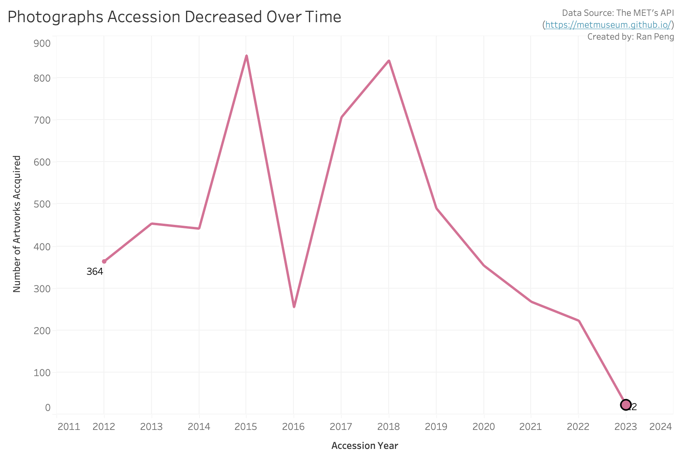

| [home page](https://cmustudent.github.io/tswd-portfolio-templates/) | [visualizing debt](visualizing-government-debt) | [critique by design](critique-by-design) | [final project I](final-project-part-one) | [final project II](final-project-part-two) | [final project III](final-project-part-three) |

# The final data story
> Link to [Shorthand Story](https://carnegiemellon.shorthandstories.com/beyond-the-exhibition-deep-into-the-mets-collection/index.html)

# Changes made since Part II
> Attempted Corrections collected from interviews and reflections in Part II

| Research synthesis             | Anticipated changes for Part III       | Did I make this change?| Additional Notes|
|--------------------------------|--------------------------------------------------|----------|---------------------------------|
| The overall story and background info are easy to follow, but the order of the topic's breakdown needs to be rethought and integrated better.| I would likely follow the suggestion of the interviewees on the order of the story, connect the first and third sections first, and rethink if it is necessary to have the second section (top five cultures breakdown) in the presentation.|Yes.| Based on the storytelling and main focus, I took out the top five cultures breakdown visual to make the presentation less confusing. I rather focus more solely on the topics of investigating the actual department breakdowns and accession years of the MET's collection.
| Clearer presentation on all top five departments' accession year trends.|I will consider putting all of them into a dashboard or include all the charts on a single page to represent better trends on the top five departments to the audiences.|No.| Since I deleted the visual of the top five cultures breakdown in my final delivery, I didn't make this change.|
| Unclear labelings of the pie chart | I will explore and try in Tableau to add the data labels and percentage breakdowns on the pie chart.|No.|I didn't make this change as I deleted the pie chart and solely using the treemap to illustrate on the department breakdown of the museum.|
|General Color selection and formatting | As I am also using two charts from the New York Times, it will be important for me to also consider using green as the main color for other visualizations to keep it consistent.| Yes.|Although I was not able to use the two charts from the New York Times, I did reselect the theme colors and formatting for all of the graphics. I selected orange as the mean color for visualizations and pop-out numbers in the shorthand story. It is because the color orange provides sufficient contrast with the background theme color of the template that I used in shorthand. Also, orange can be more uplifting and brighter than blue which can better attract audiences' attention.|

**Additional Changes Made:
- Due to copyright considerations, I took two New York Times charts out from my final delivery. Instead, I mainly used the pop-out numbers from the original data and created an icon graphic visual to represent the alternative values of the storage spaces.
- I also added an explanation of the data sources (API) that I mainly used for the project as well as elaborated more on the connection between the museum's collection and its mission achievement aiming to help the audience understand the concept and the importance of the issues that discussed in the story.
- After listening to classmates' presentations, I added additional resources that are more targeted to provide open resources for internal art managers and administrators to explore more relevant topics.
- For the accession trends visual, I added the filter of years, which I only included the last ten years to better reflect how the recent policy changes affected the number of items acquired by the museum.

## The audience
Similar to the earlier understanding of the target audience in part II, the target audience groups are both external people who are interested in museums and internal arts managers. To appeal to both audience groups, I provided background information on the museum's mission and the rationale for the importance of collection and mission achievement in the overview section; I also included further resources and online open sources that arts managers might find helpful in the summary section. Similarly, to make the data more accessible for people with different expertise and experience, I edited with detailed labels and used less confusing graphics in the shorthand story.
The photos and images that are included in the shorthand are also the museums' exterior or interior spaces to make the overall visual more relevant to the topic and consistent.

## Finalized Visualizations (not including big numbers and icons) 
>Treemap of the MET's departments breakdown.

>Drawing and Prints Accession Decreasing Trend.

>Photographs Accession Decreasing Trend.

>Top Five Departments Accession Dashboard over Time.

<noscript></noscript><object class='tableauViz'  style='display:none;'><param name='host_url' value='https%3A%2F%2Fpublic.tableau.com%2F' /> <param name='embed_code_version' value='3' /> <param name='site_root' value='' /><param name='name' value='ArtworkAccessionTrends&#47;Dashboard1' /><param name='tabs' value='no' /><param name='toolbar' value='yes' /><param name='static_image' value='https:&#47;&#47;public.tableau.com&#47;static&#47;images&#47;Ar&#47;ArtworkAccessionTrends&#47;Dashboard1&#47;1.png' /> <param name='animate_transition' value='yes' /><param name='display_static_image' value='yes' /><param name='display_spinner' value='yes' /><param name='display_overlay' value='yes' /><param name='display_count' value='yes' /><param name='language' value='en-US' /><param name='filter' value='publish=yes' /></object>
                

## References
All external references and knowledge are cited in the shorthand story (in the reference section after the summary)
In addition to those references, I've used [Unsplash](https://unsplash.com/) for all the photographs/images included in the shorthand story cited the icons that I used for creating the visuals (football fields and museum icons) from the [Noun Project](https://thenounproject.com/). 

# Final thoughts
If I have more time, I would like to dive more into the financial documents and data resources of the MET to find some relevant data or information that can support my story. I think the essential questions about how museums should maintain their collection and modify related policies are ongoing topics that I will investigate more. Besides the consideration of mission achievement, and public and educational services, museums are also considering donors' relationships when deaccessioned items or accepted artwork gifts. It will be more realistic and interesting, in future iterations, that I can include the consideration of these factors.

