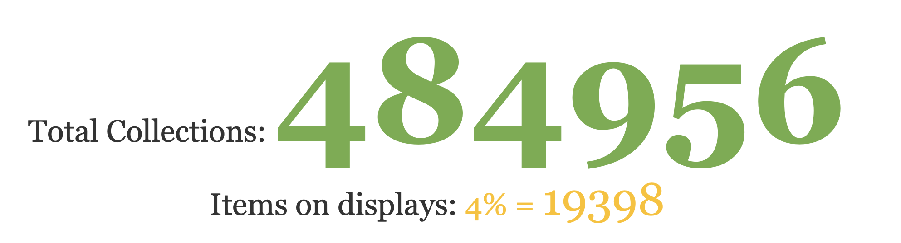

| [home page](https://cmustudent.github.io/tswd-portfolio-templates/) | [visualizing debt](visualizing-government-debt) | [critique by design](critique-by-design) | [final project I](final-project-part-one) | [final project II](final-project-part-two) | [final project III](final-project-part-three) |

# Wireframes / storyboards
The overall flow of the storytelling will be like this:
### 1. Hook (My personal connection and curiosity on the topic)
I have been to MET several times, but never got the chance to explore the entire museum (in each visit). I also have the impression that it has "countless" items in its collection that are waiting to be exhibited. Therefore I am curious about how many they actually held and what are the major cultures that are represented in the Museum. 
### 2. Introduction 
I will start with some Facts about MET, to help the audience understand why I chose this museum in particular and why it is interesting to look at its collection:
o	The largest art museum in the Americas
o	In 2022, 3208832 visitors visited the MET
o	The third most visited museum in the USA

> The BIG-number visuals will be presented here:

Then I will quote the mission statement of the MET: "The Metropolitan Museum of Art collects, studies, conserves, and presents significant works of art across time and cultures to connect all people to creativity, knowledge, ideas, and one another." and explain the relationship and the reason why mission alignment of the collection is important (main aspects being Audience Engagement, Educational Value, Relevance to Society, and Long-Term Sustainability). Also, I will introduce the 19 department categories listed on the MET's website.

Next, I will ask the audience to think of the percentage breakdowns of the artworks in each department and show the "intuitively department breakdowns" treemap to the audience to mimic how we might think about the breakdown from its website.

After that, I will show the actual breakdown of the treemap, with the dark blue color on the "Drawing and Prints" department to represent it outweighed by any other categories.

With an emphasis on the massive collections of drawings and prints, I will present the bar chart from the New York Times articles and elaborate more on the overly collected prints and drawings in MET compared with other museums in the USA. 

# User research 
## Target audience

In general, I would like to target not only anyone interested in art and museum collection developments but also more internal industry-related art/collection managers in this story. For the general public who are interested in art, I would like to provide them with more data and visualization to help them have a concrete idea of a museum's collection and the artworks it holds. For art managers, I hope such storytelling can provide them with a more quantitative approach to understanding and deciding the museum's collection. 

In order to engage with the general public, I will provide sufficient background information and explain the linkage between the museum's mission and its collection to let them know the importance of understanding and the reasons I would like to do this analysis. To engage with the art managers, I would interact more with them in the later sections and call to action, as they are the people who are really making decisions about collection management and how to present better cultures and artwork to the museum's visitors. 

## Interview script
> The goals from My research and the questions I intend to ask. 

| Goal | Questions to Ask |
|------|------------------|
|Understanding whether the topic is appealing to the general public and art managers|1.	Are you interested in the topic that I discussed? (Before the story and after the story) |
|Understand the interviewee's background: art or non-art|2.	Did I provide sufficient info for you to understand the background of this story?|
|Noting potential corrections for visualizations|3. Do you find the visualization helpful for you to understand my story?|
|Knowing from the interviewee's perspective to examine if the storytelling that I presented targets the correct audience group|4. Who do you think should be the intended audience?|
|Double-check with the interviewees about the overall flow of the storytelling|5.	Is there anything you would like me to explain more?|

## Interview findings
> Detail findings from interviews, the general descriptions of interviewees are included in the parentheses 

| Questions               | Interview 1 (Student, early 20s, art history background) | Interview 2 (Student, early 20s, non art background) | Interview 3 (Manager, mid 40s, some art background)|
|-------------------------|---------------------|---------------------|---------------------|
|1.	Are you interested in the topic that I discussed? (Before the story and after the story)|Yes, as an art student, before the story I am interested in the topic and also curious about how many artworks are there in the MET. After the story, I still wanted to know more and dive deeper into collection management and wondering how art managers think about the issues you are talking about.|             |Before the story, I didn't really think too much about the issues in collection management in such a detailed manner. I am interested in the topic after the story.|
|2.	Did I provide sufficient info for you to understand the background of this story?| Yes, I appreciate how you explain the overall mission of the MET and the important connection between its collection and the mission.| As someone from a non-art background, the information you provided is very helpful, so yes.| Yes. I didn't know such info before the talk, so it is really useful for me to understand the context and why this topic interest you. It also helps me to create a general framework on the topic.|
|3. Do you find the visualization helpful for you to understand my story?|Overall, yes. I love how you started with a large number of facts about the MET to explain why you chose this particular museum also the changes between the "intuitive thinking" and the actual breakdown per development are interesting to see. I also like the comparison between the MET and other museums, which helps me to understand why it can be a little more concerning in its collection management. The pie chart is less clear compared to the other ones. You can try to include the percentage of each color in the chart. I am a little confused whether Asian or Greek Art has a higher % in the total collection. |             |Yes, the area chart and the bar chart are easy to understand and I can grasp the key info, which is that the MET holds way more drawings and prints in its collection than other departments. The pie chart and the explanation on the culture emphasis, however, to me is a bit off the topic that it seems to be a separate question that you want to discuss but don't have time to do so.|
|4. Who do you think should be the intended audience?|The general public and people who work in art/museum fields|People who often visit museums|Museums' collection managers, program developers, and curatorial teams|
|5.	Is there anything you would like me to explain more| For the accession year of the top five departments, I would like to see all of the trends rather than only the trends of Greek art. Maybe more visual and content emphasis on that? Also, if possible, I would like the order of the overall storytelling to be changed a bit, which the second part seems to be a jump between the first and the third section, maybe reorder them into 1-3-2? I do feel that the second part is a bit off the topic that you might want to rethink on how to integrate it better into the overall storytelling.|Nope, I think you provided enough info for me to understand the topic.|As I just mentioned about the pie chart, you might want to explain more about why you would like to include that information in the whole story and include a more obvious takeaway from that visualization.|

# Identified changes for Part III
> The changes I plan on implementing next week to address the issues identified.  

Text here!

| Research synthesis                       | Anticipated changes for Part III                                                |
|------------------------------------------|---------------------------------------------------------------------------------|
| The overall story and background info are easy to follow, but the order of the topic's breakdown needs to be rethought and integrated better.| I would likely follow the suggestion of the interviewees on the order of the story, connect the first and third sections first, and rethink if it is necessary to have the second section (top five cultures breakdown) in the presentation. |
| Clearer presentation on all top five departments' accession year trends.|I will consider putting all of them into a dashboard or include all the charts on a single page to represent better trends on the top five departments to the audiences.|
| Unclear labelings of the pie chart | I will explore and try in Tableau to add the data labels and percentage breakdowns on the pie chart.|

> ...include any final thoughts you have here. 

